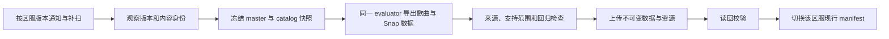

# 歌曲 meta、组卡与识别数据的自动更新

状态：2026-10-01，Draft 设计。修复既有数据发布流程可先进行；最新游戏建模和搜索策略的验收仍是正式组卡功能的前置条件。本文件不表示自动更新修复已部署。

## 当前实际链路与故障

StarMoe nnnotes 已有 `music-data.yml`：接收 `masterdata-updated`，每日补扫，并允许手动强制重建。它比较 master/resource/client 版本、resource hash、Deck/nnnotes commit 和 recipe，构建后运行 schema、来源、谱面、统计、音乐长度与消费端 smoke 检查。已有归档、发布开关和上传读回校验，应在此基础上修复。

截至本轮检查，[最近一次定时任务](https://github.com/StarMoe-org/nnnotes/actions/runs/36699637364)的 plan 成功、Build 步骤失败；之前三次 dispatch 也失败。实际错误是谱面 `10010900` 的资产不存在，涉及 catalog 与源快照不一致。当前发布仓库 main `c5f39f8` 已加入按 snapshot resource version 选择 catalog、核对 hash 并禁止回退到不匹配 catalog 的修复；需要新的完整 dry run 验证，不重复复制已有修复。添加定时器本身不会解除此故障。

MoeNotes 当前客户端直接读取 `music-data.json`。默认线上文件在本轮读取时为 TW、客户端 `1.0.1/25`、master `0b21c9f4a3911370d5f981fb894c7544`，SHA-256 为 `983896151d3ed69d9dfe26044225907e33be037e4b74589e110ded64780f8738`。这份文件含 85 首歌；网页能读取文件，不证明它仍是对应区服的当前版本。

用户提供的两张门槛截图分别与《青春コンプレックス》（`100021`）的上述 TW 门槛及既有 JP 快照的 `requiredScore` 完全相符。JP 的 `battleRequiredScore` 又是另一组值。回归必须保留区服和字段单位，不能将两张图直接解释为同一版本的算法修复。

## 更新单元

按区服分别形成冻结快照，TW 和 JP 的输出目录、队列、现行指针和检查基线都独立。界面语言不决定区服，ID 相同也不保证规则或数值相同。

| 身份 | 必须绑定的内容 | 变化时的处理 |
|---|---|---|
| 客户端规则 | 平台、版本/build、APK 签名、原生库和 metadata、激活 patch 集合、模型源码/产物和认证范围 | 重做受影响的原生对照；不继承旧客户端的认证标签 |
| master | 官方版本、manifest hash、被导出表的文件名与 hash 映射 | 同版本内容变化也重建；拒绝读到一半切换的快照 |
| 资源 | 资源版本/hash、catalog hash、谱面和音频资产 hash | 即使 master 不变，也重新导出受影响歌曲 |
| 计算 | evaluator commit/二进制 hash、exporter commit、schema/recipe、支持范围 | 模型修复也重新计算；不能仅等待游戏换 master |
| 消费与识别 | 消费端固定版本、识别权重/图库/索引、Snap profile 及依赖 | 验证版本兼容；新卡无识别索引时保留人工输入能力 |

Version 观察记录与已发布快照分开保存。观察时间刷新不应重复重建；源版本、内容或计算 recipe 变化才触发构建。Version 请求失败时，记录最后成功观察与失败状态，不把缓存快照改成“当前最新”。

## 检测、构建与发布

1. **检测**：复用 masterdata-sync 通知及定时补扫。通知只表示“需要检查”，不作为可信版本输入。日扫是当前兜底；需要更短延迟时，先测源同步间隔和构建耗时，再调补扫频率，避免重复大构建。
2. **冻结**：读取源 index，核验 manifest 与每个所需文件 hash。下载使用确定快照路径；若服务只有可变路径，则下载后再次核对 index 内容身份。源在过程中变化时丢弃不一致结果并排队最新版本。
3. **计算**：歌曲计算、固定队伍复算和组卡计算共用 Deck evaluator。导出完整谱面事实、音乐/计分时长、评级门槛和 Snap profile；线性统计只在已经证明适用的域保留，不能扩展为任意技能公式。
4. **检查**：内容/schema/引用检查、当前消费端 smoke、支持范围检查和定向回归全部通过。发布前再次比较源身份；旧构建不覆盖新的源观察或现行快照。同区服普通与 prebuilt 发布使用同一个锁。
5. **发布**：先上传按内容哈希命名的不可变数据、WASM 和 profile，再读回校验。最后只切换一个包含上述引用及身份的区服 manifest。归档保留用于复现和回退；读回失败时不切换指针。

现行 `music-data.json → build.json` 顺序不能视为跨对象事务：前者写入成功、后续检查失败时，可能出现文件已更新而 marker 仍旧的状态。迁移前仍以单个自包含 JSON 的 provenance 为其身份，不让客户端把旧 marker 和新文件拼起来。迁移后的客户端从唯一 manifest 读取不可变文件，校验实际字节后才激活完整快照；旧路径仅作兼容输出，不承担多资源一致性协议。

## 数据修正与新规则分别处理

自动刷新不能要求每次标题、门槛或已支持技能参数变化都重新恢复整份原生库，也不能让新枚举静默进入旧公式。

| 变化 | 自动处理 |
|---|---|
| 标题、歌曲归属、奖励门槛等源事实 | 核验新快照与映射后更新；保留字段原义，避免评分系数、每人要求分数和房间总分混用 |
| 已认证域内的技能数值、时长、谱面 | 运行依赖闭包和边界检查，用固定 evaluator 重算；回归通过后发布，并标明认证的适用域 |
| 新 effect/condition/target/cumulative 类型，或未认证的组合 | 发布已核验的源事实可以继续；受影响计算标为 unsupported，不产生虚假排行数值 |
| 原生客户端/patch 改变，或参数越出认证域 | 新源数据与旧计算认证分开；受影响 meta 保留最后通过快照及日期，等待最新原生差分 |
| exporter/模型修复 | 同一源快照重新计算，recipe/commit 与数据 hash 改变；回归通过后替换计算结果 |

支持范围是结构化规则，包含版本、模式、技能种类/组合、参数域及验证报告 hash；不能只写一个全局 `verified=true`。标准技能榜、固定真实卡组榜和玩家持有卡池搜索榜分别声明输入。玩家选择 Snap 后，排行 profile identity 必须进入缓存键；更换歌曲时重新计算标签条件与综合力。

## 两首歌的定向回归

`100021`《青春コンプレックス》和 `100026`《Ave Mujica》作为维护用例，检查所有难度、原始门槛字段、计分音符转换、技能/fever 边界及音乐长度。回归基于版本化原始表和谱面，不硬编码榜单名次。

每次比较输出明确区分：源表差分、资产差分、evaluator 差分，以及相同输入下的消费端显示差分。原生差分使用同区服、同快照和实际生效客户端/patch。某个排行下降只有在 profile、打法、随机条件、模式和目标相同的情况下才是可比较的模型结果。

## 玩家看到的结果

玩家需要知道当前区服、数据日期、计算条件和结果是否仍可用。失败状态保留最后通过的数据，并展示最后成功版本和受影响计算范围；不能每次后台检查失败就清空已有榜单，也不能继续把旧榜单称为最新。

打开歌曲或组卡会话时固定完整数据身份。后台发现新版后提示更新，玩家选择切换时重建 roster 映射和模型会话、增加 inputRevision、丢弃旧响应。搜索中途不热替换 master。缓存按区服、数据 hash、模型 hash、profile 和 scenario 区分，玩家持有事实不因清理计算缓存丢失。

## Draft 验收

- 同 master 版本下 manifest/文件内容变化仍触发重建；仅观察时间变化不触发。
- master、资源、evaluator/exporter、schema/recipe 和固定消费端改变都有独立的检测证据。
- 两区服独立构建和发布；dispatch、补扫及 prebuilt 同区服发布互斥。
- 源在下载或发布前切换、缺表、未知技能、hash/schema/smoke 失败都不激活混合快照。
- 上传中断、读回失败和指针切换失败有可重试测试；回退只指向完整且通过检查的归档。
- 自动任务的成功摘要记录 observed/built/published 三个身份与时间；失败任务保留无凭证的诊断及检查报告。
- 两曲数据门槛回归与共享 evaluator 的 song/deck 同输入一致性回归通过；最新原生认证缺口单独列明。

先修复已有发布链并形成 Draft，再把快照协议纳入 MoeNotes 的正式接入。开启生产发布、迁移客户端与最新模型认证是不同的交付状态。
