# 网页组卡：交互与流程设计

状态：2026-10-02，Draft 设计稿，交主线评审。本文只定页面、流程、状态和数据归属，不改变 [交付门槛](primary-delivery-gates.md) 里 M/S/B 的未通过状态，也不表示计分模型或搜索已经可以上线。玩家目标与输入的语义以 [玩家目标与组卡模型前置设计](player-objectives.md) 为准；两者冲突时以那份为准，并回来改本文。

设计图都是示例数据，卡名、角色名、分数均为占位。

- 截图：[`web-ux/png/`](web-ux/png/)（22 张，桌面 1440 宽，手机 390 宽 @2x）
- 可直接打开的静态 HTML：[`web-ux/html/`](web-ux/html/)（已去掉脚本，只依赖 Google Fonts）
- 可编辑源文件：[`web-ux/source/`](web-ux/source/)（`.dc.html` 画板、画布布局与渲染脚本，见文末“图怎么重新生成”）

微操（真实触控时序）已在 2026-10-02 停止，页面里不再出现相关入口和说明。

## 1. 目标与原则

1. **卡池和组卡分开。** 卡池属于账号里的游戏账号（或未登录时属于本机），由“我的卡池”页维护；组卡只读取它。Snap 排行等其他工具也读同一份。
2. **少操作。** 第一次用：选目标 → 上传截图 → 回答几项关键问题 → 看结果。之后再用：选目标 → 看结果，只有新出现的关键未知才会再问。
3. **只问会改变推荐的东西。** 技能等级读不出来，不要求玩家补全 63 张卡；只问会让推荐变化的那几张，答案写回卡池。
4. **不知道就说不知道。** 有未知会影响结果时，分数显示为区间、队伍标“可能变化”，不给不带条件的“最强队”。
5. **不登录也能用，但不存进任何账号。** 未登录的卡池只放在这个浏览器（IndexedDB），或者只用这一次。

## 2. 页面一览

| 编号 | 页面 | 截图 | 作用 |
|---|---|---|---|
| 1 | 目标、卡池与歌曲 | `01`–`04` | 选目标；显示当前卡池状态；选歌曲、难度、场景、名次假设和打法 |
| 1a | 更多选项（弹层） | `05` | 对比基准队、这次不用的卡、必须上场、搜索时长 |
| 2 | 补这次需要的信息 | `06` | 只列影响推荐的未知：技能等级、没认准的卡 |
| 3 | 推荐结果 | `07`–`11` | 可照摆的五槽和配对 Snap、分数分布、候选、计算依据 |
| 手机 1/2/3 | 同上，单列 | `12`–`14` | 底部固定主按钮；大号 Lv 按钮 |
| 账号 | 我的卡池 | `20`、`21` | 卡池本体：游戏账号切换、完整度、卡片网格、增量更新、导入导出 |
| 账号 | 首次建立卡池（弹层） | `22`–`25` | 从组卡打开；上传 → 识别 → 确认；未登录时选“存本机 / 只用一次” |
| 账号 | 修正一张卡 | `26` | 身份候选、冲突值二选一、字段来源 |
| 账号 | 登录后存进账号 | `27` | 本机卡池迁入账号；账号已有卡池时合并 |

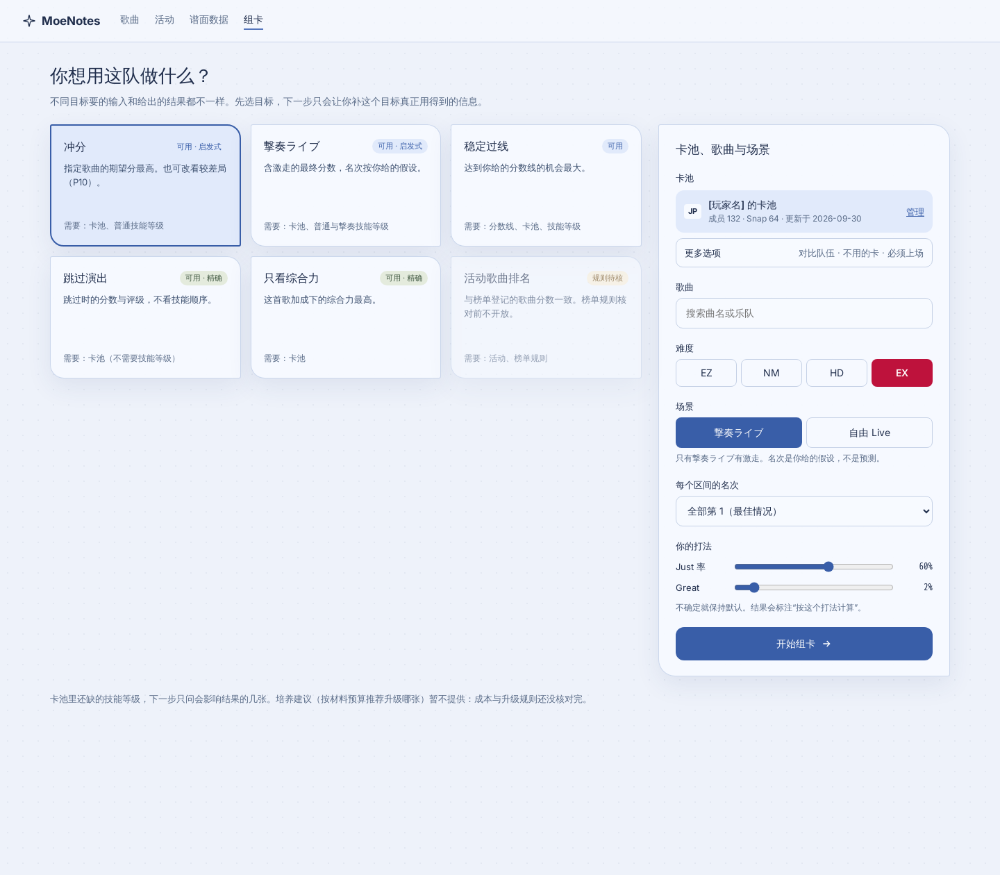

## 3. 信息归属

| 数据 | 归属 | 生命周期 |
|---|---|---|
| 持有的卡及其等级、特训、卡阶、技能等级 | 卡池（按游戏账号；未登录时本机或临时） | 长期；截图增量更新，手动值优先 |
| 每个字段的来源 | 卡池 | `截图`（哪张、哪天）/ `手动` / `组卡时手动`；冲突时保留两份观察 |
| 卡池是否完整的声明 | 卡池，单独字段 | 玩家在建立或更新时勾选；不与“这次不用的卡”混用 |
| 我现在用的队（对比基准） | 卡池 | 在“更多选项”里选，下次默认 |
| 目标、歌曲、难度、场景、名次假设、打法 | 这次组卡 | 可放 URL 状态，便于分享条件（不含卡池） |
| 这次不用的卡、必须上场、搜索时长 | 这次组卡 | 只影响搜索；被排除的卡仍算持有，回忆加成照算 |
| 推荐结果 | 这次组卡 | 绑定输入快照；任何输入变化即标为过期 |

“这张不是我的卡”是改卡池（删除或改身份），“这次不用”是搜索约束，“拥有但没填”是字段未知，三者不能合并成一个开关。见 player-objectives 的“持有事实与搜索卡池必须分开”。

## 4. 状态机

### 4.1 卡池来源（目标页右侧面板）

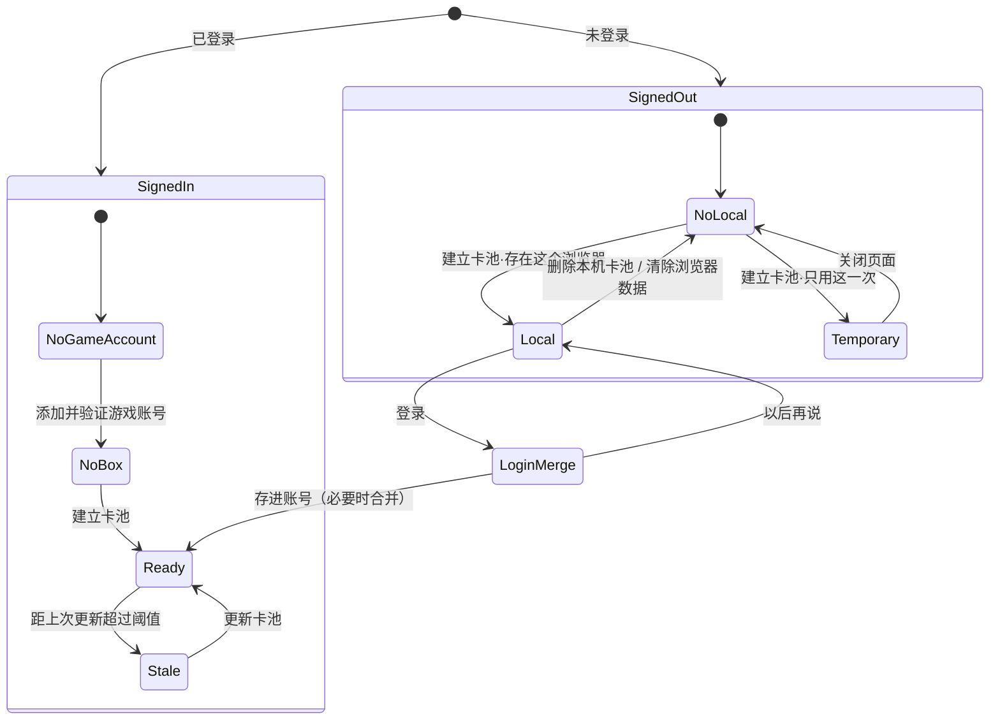

| 状态 | 截图 | 面板显示 | 主按钮 |
|---|---|---|---|
| `signedOut`（本机无卡池） | `02` | “不登录也能用”；上传截图建立卡池；登录为次要链接 | 开始组卡不可用，文案“先准备卡池” |
| `temporary` | — | 标签“临时”：关掉页面就没了 | 开始组卡 |
| `local` | `03` | 标签“本机”；提示清除浏览器数据会丢失；“登录后存进账号” | 开始组卡 |
| `noGameAccount` | `04` | 添加游戏账号；或先存在本机 | 不可用 |
| `noBox` | — | 上传截图建立卡池 | 不可用 |
| `ready` | `01` | 游戏账号、玩家名、数量、更新时间；“管理” | 开始组卡 |
| `stale` | — | 同上，另提示“32 天没更新，新卡不会被考虑”；可先组卡 | 开始组卡 |

建立卡池的弹层完成后直接回到组卡，已选的目标和歌曲保持不变。

### 4.2 组卡流程

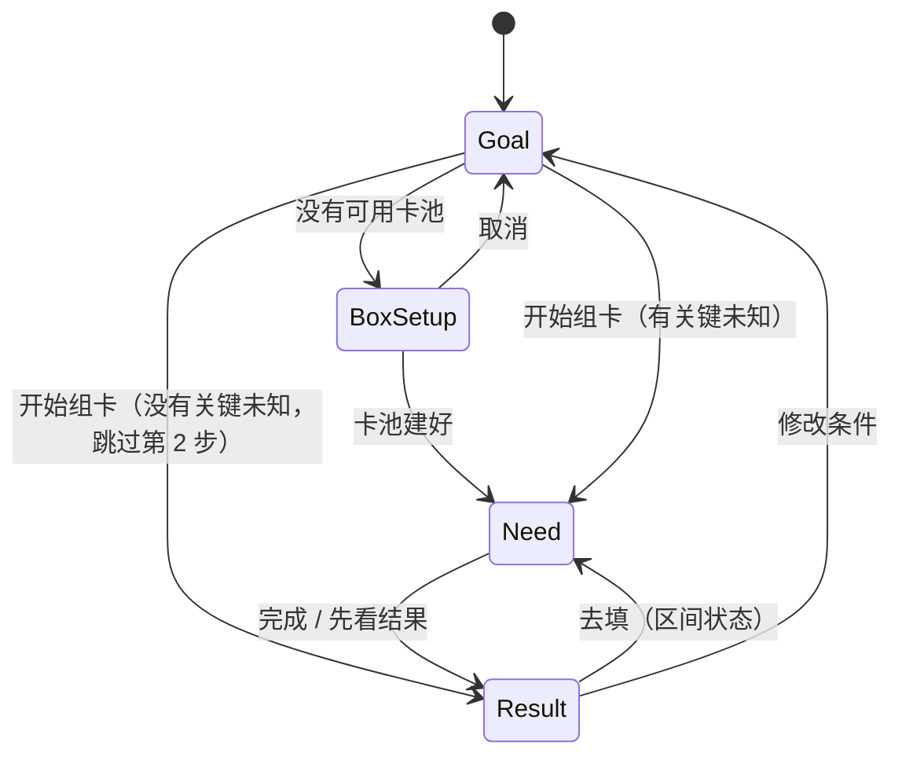

第 2 步只在“存在关键未知”时出现；什么都不需要问时直接进结果，步骤条显示为已完成。

### 4.3 结果状态

| 状态 | 截图 | 何时 | 显示 |
|---|---|---|---|
| `searching` | `08` | 搜索中 | 进度、已评估候选数；“停止，用目前最好的” |
| `done` | `07` | 搜索结束，无影响结果的未知 | 单个期望分、P10/P50/P90、候选 |
| `range` | `10` | 仍有未填的关键未知 | 分数为区间；列出是哪几张卡；“去填（N 张）” |
| `stale` | `09` | 输入快照之后，卡池、目标、歌曲或选项有变 | “这个结果已过期”；重新计算 |

启发式搜索的结果始终带“可能还有更好的队伍，差距未知”，不叫最优。

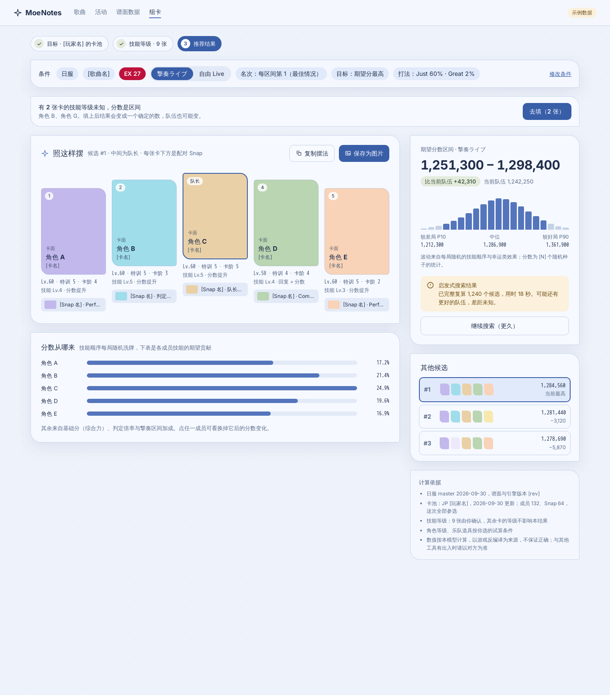

### 4.4 字段值的生命周期（卡池内每张卡的每个字段）

| 状态 | 来源 | 后续截图能否覆盖 | 组卡时 |
|---|---|---|---|
| `unknown` | 截图读不到（技能等级永远如此） | 能（若将来能读） | 按 Lv1 和 Lv5 分别评估，见第 5 节 |
| `observed` | 截图，记录哪张、哪天 | 能，新观察替换旧观察 | 直接使用 |
| `manual` | 卡池页手动，或组卡时回答 | 不能；新截图与它不同只提示 | 直接使用 |
| `conflict` | 两张截图读数不同 | — | 当作未知处理；卡池页“要处理”标签里出现，修正弹层里二选一（`26`） |

身份同理：识别没认准的卡先按最像的候选计算，只有当它会进入推荐或改变推荐时才在第 2 步请玩家确认。

## 5. 技能等级：懒询问与回写

背景：游戏的排序键（Acquired/CardPower/Rarity/Level/Character/Awake/Rank）都不含技能等级。技能等级只在单卡强化的技能页里显示，卡池列表截图读不到。JP 现有 63 张成员卡，普通技能和撃奏技能各 Lv1–5。逐张手填负担太大。

做法：

1. 选定目标、歌曲和场景后，取当前目标会用到的技能类型（普通演出要普通技能；撃奏ライブ还要撃奏技能；跳过演出和只看综合力一项都不要）。
2. 对每张技能等级未知的候选卡，分别按 Lv1 和 Lv5 评估。两端都进不了推荐、或者两端推荐相同的卡，不问。
3. 剩下的卡按“影响多少分”排序，在第 2 步列出（`06`、`13`）。每张给 Lv1–5 单选；提供“全部 Lv1 / 全部 Lv5 / 清空”。撃奏技能默认“与普通相同”，取消后才多出一行。
4. 填写的值以来源“组卡时手动”写回卡池，下次不再问。
5. 不填也能看结果：未填的卡把分数变成区间（`10`），并说明填哪几张能收窄。

前提与风险：第 2 步的筛选假设分数对技能等级单调（等级越高不会更差）。这一点尚未验证；若存在反例（例如概率型或互斥效果），要改成对候选队实际枚举，或者对这类技能总是询问。在验证前，这个筛选只能叫“启发式”，结果页的计算依据里要写明。

卡池页上，技能等级只显示中性的“已知 21 张”，不画完成度进度条，以免暗示玩家必须填满。

## 6. 存储

| 场景 | 位置 | 说明 |
|---|---|---|
| 已登录 | starmoe-api，按 `(server, profileId)` 存一份卡池 | 需要新接口，现在没有。现有 `/api/me`、`/api/me/game-accounts`、`/api/players` 只有资料和 `favoriteCard` 的单卡技能等级 |
| 未登录·存本机 | IndexedDB，按区服一份 | 永不上传；页面说明清除浏览器数据会丢失；可导出/导入文件 |
| 未登录·只用一次 | 内存 | 关闭页面清除 |

建议的新接口（草案，命名由 API 维护者定）：

- `GET /api/me/game-accounts/{id}/box`：返回卡池、`version`、`updatedAt`
- `PUT /api/me/game-accounts/{id}/box`：带 `If-Match: version`，冲突时返回 409，客户端走合并
- `PATCH` 单卡字段：用于组卡时回写技能等级，避免整份覆盖
- 卡池仅本人可见；其他人和公开页面都不读

截图只在浏览器里识别，原图不上传；卡池里保存的是识别结果和来源标记（截图序号、日期、定位框），是否保存裁切小图另议。

### 登录后的合并（`27`）

- 本机卡池只能存进同区服的游戏账号。
- 账号里没有卡池：直接存入。
- 账号里已有：默认“合并”——每张卡取较新的观察；手动值优先于截图值；两边都是手动值且不同的，逐条再问。也可选“用本机这份”或“保留账号那份”。
- 存好后删除本机副本，避免两份各自更新。

## 7. 各页要点

### 1 · 目标、卡池与歌曲（`01`–`04`）

- 目标卡片：冲分、撃奏ライブ、稳定过线、跳过演出、只看综合力、活动歌曲排名（规则待核，不可选）。每张写“需要：…”，让玩家提前知道会被问什么。最终目标集合以 player-objectives 为准；培养建议不在本期。
- 场景默认撃奏ライブ，可切自由 Live；名次是玩家给的假设，不是预测。
- 打法：Just 率、Great 率滑块，默认值标注为假设。
- “更多选项”入口在卡池块下面（`05`）。

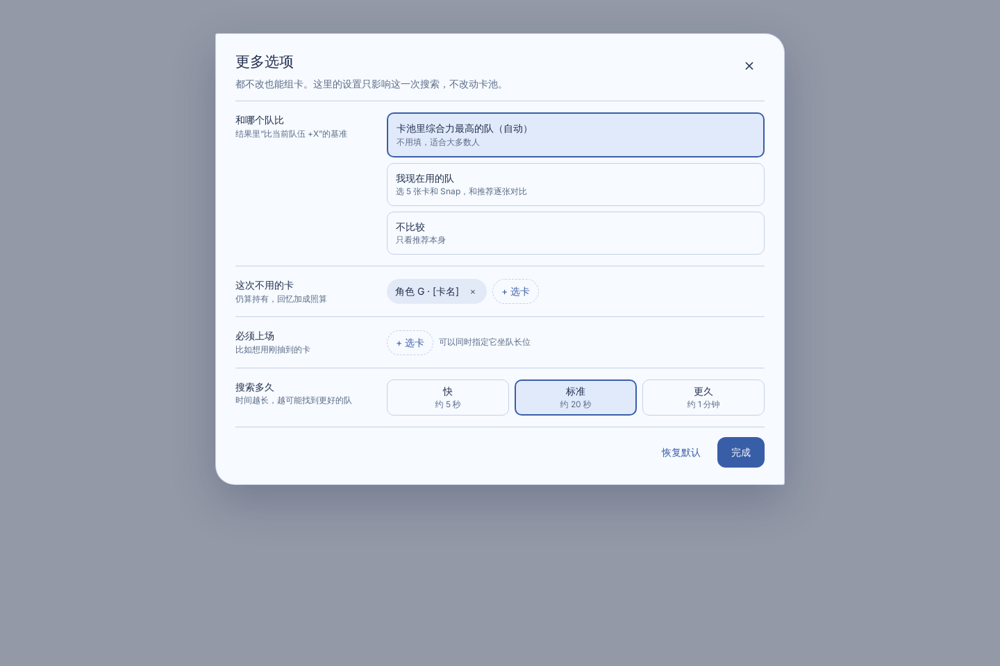

### 2 · 补这次需要的信息（`06`）

- 标题直接说“还需要确认几项”，副标题说明已知多少张、其余按什么假设。
- 没认准的卡排在最前：显示截图裁切和最像的候选，“对的 / 不对，改一下”。
- 技能等级列表按影响排序，每张标“影响约 N 分”。
- 两个出口：“先看结果”（未填的变区间）和“完成，看结果”。
- 帮助：游戏里在哪看技能等级；“不填会怎样”。

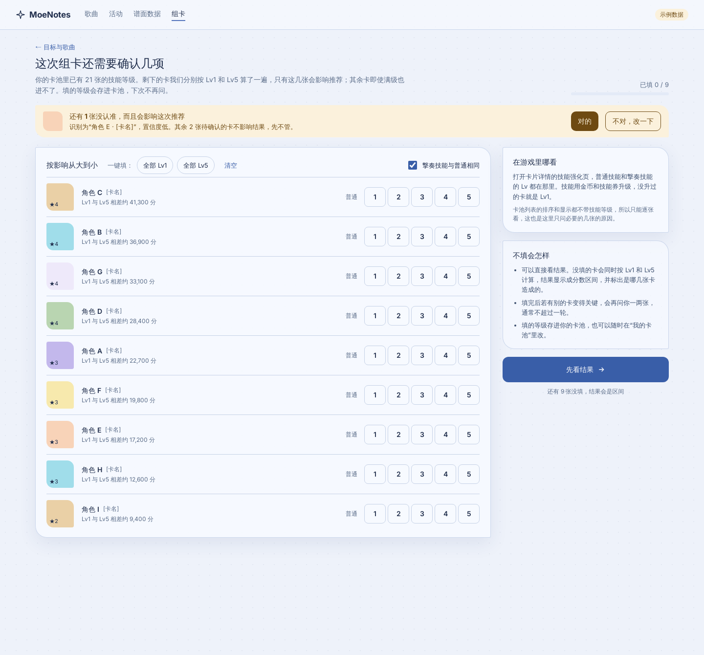

### 3 · 推荐结果（`07`）

- 条件条：区服、歌曲、难度、场景、名次、目标、打法；“修改条件”回第 1 步。
- 照这样摆：五个物理槽，第三槽为队长，每张卡下方是配对 Snap；“复制摆法 / 保存为图片”。
- 分数：期望分、相对对比基准的差、直方图与 P10/P50/P90；说明波动来自技能顺序与幸运类随机。
- 分数从哪来：各成员技能的期望贡献。
- 其他候选 Top-3，点选切换上方摆法。
- 计算依据：master 日期、引擎版本、卡池快照、技能等级来源、试算条件，以及“以反编译为来源，不保证正确；与其他工具有出入时以对方为准”。

### 手机（`12`–`14`）

单列，底部固定主按钮，Lv 按钮 44 px 以上。手机上撃奏技能默认同普通，需要分开填时引导到电脑版或卡片修正。

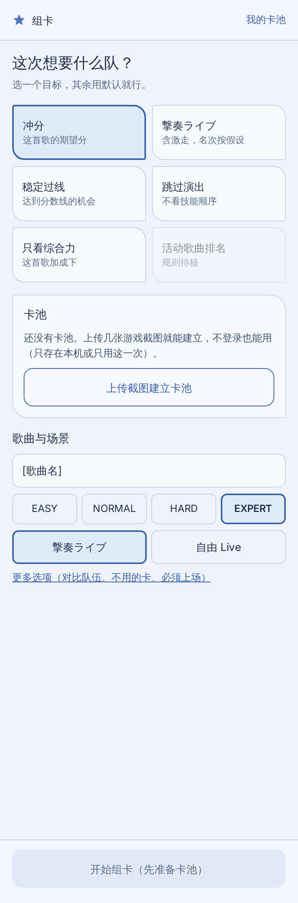
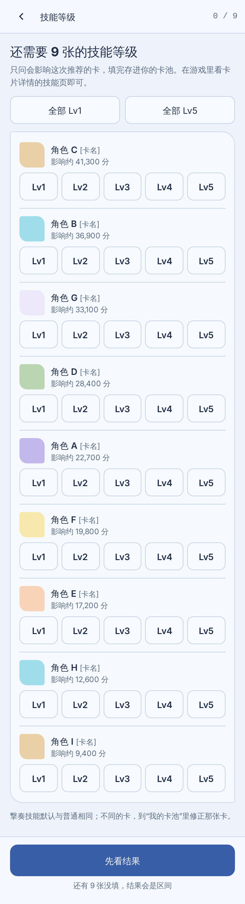
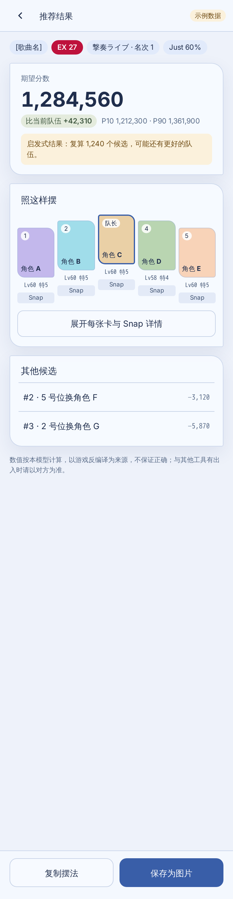

### 我的卡池（`20`、`21`）

- 已登录：顶部切换游戏账号，每个游戏账号一份卡池；未登录：“本机卡池”横幅和“登录并存进账号”。
- 完整度：成员数、Snap 数、没认准数；技能等级只写“已知 N 张”。
- 标签：成员 / Snap / 要处理（冲突与没认准）。
- 更新卡池：拖入新截图增量合并，手动值不被覆盖；列出最近变化。
- 导出 / 导入 / 删除卡池。

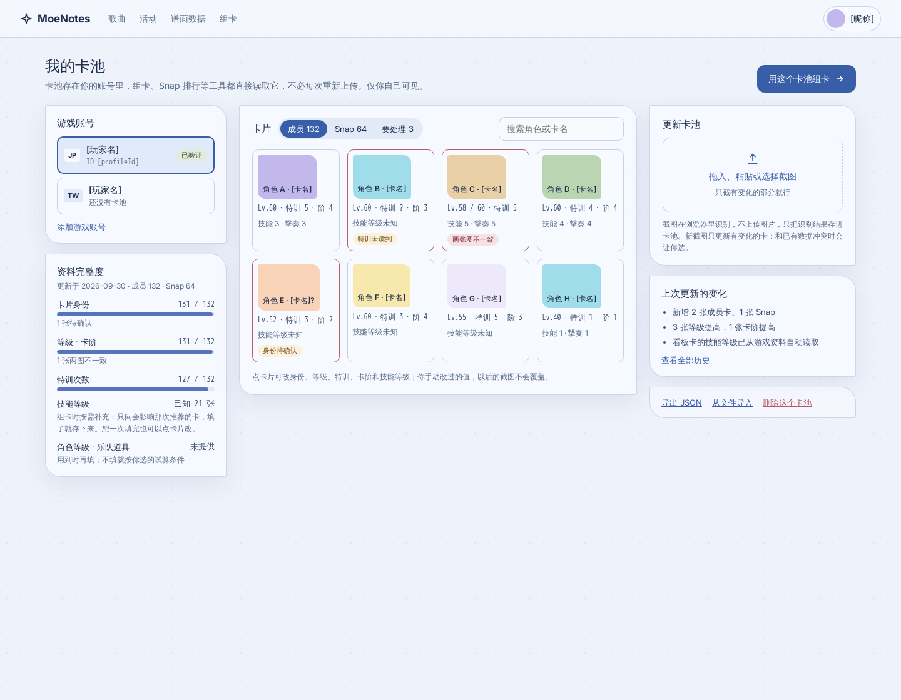

### 首次建立卡池（`22`–`25`）

上传 → 识别 → 确认三步。完成页给出成员 / Snap / 没认准数量，并有“截图包含了我全部的卡”复选框（单独保存的完整性声明；不勾时没截到的卡按“不确定有没有”处理）。主按钮文案随保存方式变化：保存并继续组卡 / 存到本机并继续组卡 / 继续组卡（不保存）。

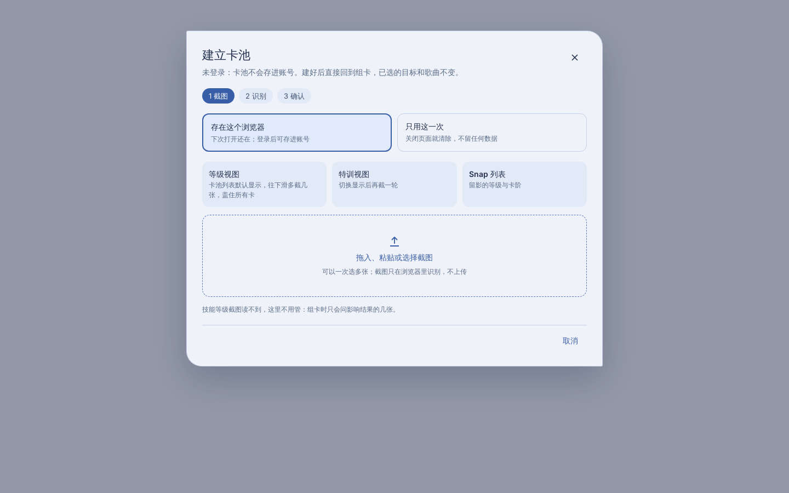
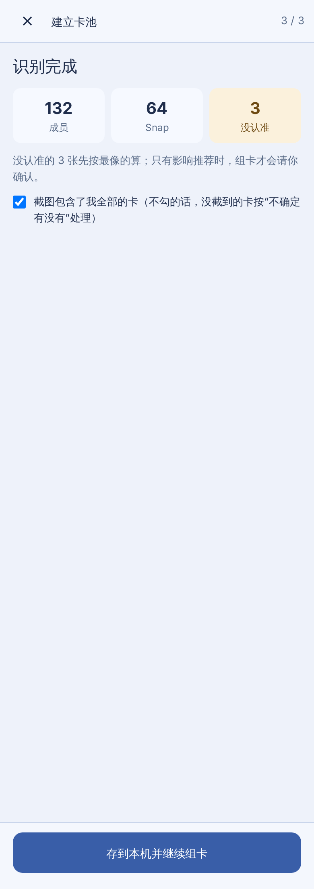

### 修正一张卡（`26`）

左侧是截图裁切，右侧依次是身份候选（可搜索）、各字段及来源。两张截图读数不同时并列显示，二选一。改过的值标“手动”。底部可“这不是我的卡，删掉”。

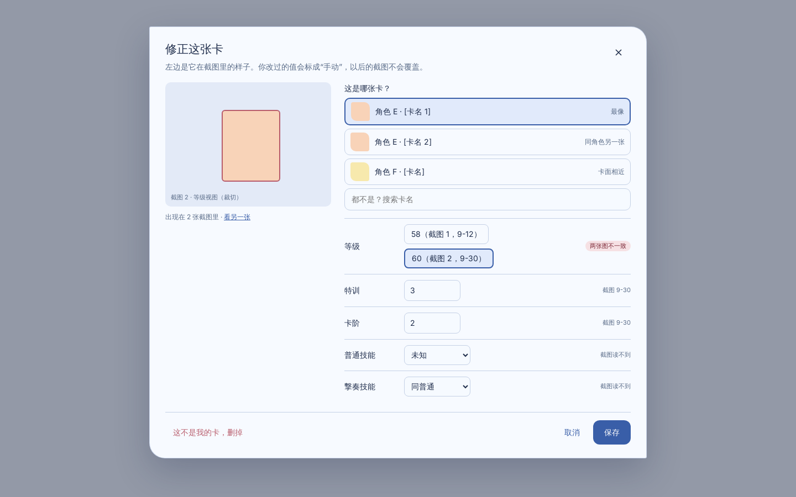

## 8. 未完成与待定

| 项目 | 现状 | 建议 |
|---|---|---|
| 角色等级、乐队道具、VIP、回忆等全局状态 | 截图读不到；本设计没有对应输入页 | 与技能等级同一套懒询问：放进第 2 步，答案存进卡池的“玩家状态”；未提供时按明示的试算条件计算并写进计算依据 |
| 识别失败 / 浏览器不支持 | 无专门画面 | 识别失败的截图单列，可重试或手动添加；不支持的浏览器提示换浏览器，并允许导入卡池文件 |
| 未验证的游戏账号能否存卡池 | 未定 | 建议仅已验证账号可存；未验证时引导验证，或先存本机 |
| 卡池过期阈值 | 示例为 30 天 | 由产品定；也可以在新卡池期或版本更新后提示 |
| 活动歌曲排名目标 | 规则待核 | 保持不可选，直到 player-objectives 的规则门槛通过 |
| Snap 歌曲排行、固定队伍评估 | 已有页面草稿，未纳入本流程 | 改为读同一份卡池；不再各自上传 |
| 多语言 | 仅中文稿 | 文案集中管理；游戏专有名词保留原文 |
| 技能等级单调性 | 未验证 | 见第 5 节；验证前结果页注明筛选是启发式 |
| 后端卡池接口 | 不存在 | 见第 6 节草案 |

上线顺序仍受 M/S/B 门槛约束：页面可以先接示例数据和已有 PoC，但“你的推荐队伍”必须等计分与搜索门槛通过后才对玩家开放。

## 9. 图怎么重新生成

源文件在 `web-ux/source/`：12 个 `.dc.html` 画板、`canvas.json`（画布布局），以及

- `build_variants.py`：把每个画板按状态（如 `boxState`、`resultState`、`storage`、`mode`、`phase`）的默认值改写成 22 个变体页面；
- `render.mjs`：用 Playwright Chromium 逐页截图，并导出去掉脚本的静态 HTML。

画板运行时（`support.js`）来自设计工具，不随仓库提交。本批图在 CNB 开发机的 `mcr.microsoft.com/playwright:v1.48.2-jammy` 容器里渲染，命令为：在变体目录起静态服务（端口 8765），再 `node render.mjs`。
