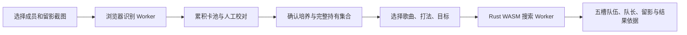

# 卡池截图与组卡：MoeNotes 接入方案（Draft）

MoeNotes 是玩家入口。`ournotes-boxlens` 负责截图中的身份与可见培养字段，`ournotes-deck` 负责游戏规则、计分和搜索，MoeNotes 负责校对、目标选择、结果解释与本地保存。各层复用已有版本化契约，不在页面里另写一套评分公式。所有本轮 PR 保持 Draft，**最新游戏模型与搜索策略完成评审所需证据之前，冻结正式实现**。本轮先前写出的运行端/展示/识别接线代码仅保留为试验，不构成正式落地决定。

这个 PR 提供运行端选择、数据版本绑定和 Worker 消息契约，以及对应回归。它尚未添加上线路由、模型运行时、权重附件或组卡页面；不会把可行性方案标成已上线功能。历史输入管线与推荐基线分别来自 BoxLens `6d3326d`、Deck `f755c9c`；其旧 PR 已关闭，本轮新增能力采用独立 Draft，后续发布需要固定具体 commit 和文件 SHA256。

## 正式实现的两道前置门槛

| 门槛 | 必须形成的结论 | 当前状态 |
|---|---|---|
| 最新版本建模 | 按区服冻结客户端/构建/签名、ELF/metadata、master/资源/谱面与激活补丁身份；核对关键规则、所有生效技能类型与模式；最新原生逐单元和逐帧差分，未验证内容显式列出 | **未通过**。日服 Android 1.0.4 / build 10053 完整包已找到，APK 与原生库/metadata 已按哈希绑定；仍需最新原生恢复/执行、patch 状态和语义对照。既有原生证明仍是 TW 1.0.1-25。今天的在线 Version 读取尚未成功，不能把 9/30 的 master 快照重标为当前 |
| 搜索策略定稿 | 玩家真实目标→目标函数/约束；人类打法与随机/网络条件；物理队伍身份和 tie；精确搜索的合法域/上界/穷举证明；候选搜索的覆盖、质量、预算与可解释限制 | **未通过**。现有 finite-root/单条打法 PoC 能精确算条件值，尚未证明真实种子总体、人类失误分布、大池全局最优或全部最新规则；快速基准只作为策略样本 |

日服 iOS 版本的原始来源为 [官方 App Store](https://apps.apple.com/jp/app/id6771716739) 与 Apple Lookup，发布日期 `2026-09-29T11:38:20Z`。这不是 Android ELF、运行时 IFix 或线上 master 已完成认证的证据。版本更新日志写了“修复”也不能替代对应逻辑对照。

前置材料为 [最新模型验证矩阵](deck-design/model-validation.md)、[玩家目标与输入依赖](deck-design/player-objectives.md)、[搜索数学与质量门槛](deck-design/search-design.md)、[共享计算与 Snap 数据契约](deck-design/shared-evaluation-and-data.md)及[自动更新设计](deck-design/data-update.md)。先按这些材料补证、确定模型和策略，再选择 SDK 包装和页面实现；WASM 能跑、组件能渲染、mock 链路能完成都不能代替这两项。

## 歌曲计算、组卡与留影效果共用模型

两类计算使用同一入口：`Evaluate(snapshot, chart, physicalDeck/supportPairs, memberSkills, snapSkills, play, randomLaw, externalContext) → trace + metrics`。固定同一输入时，歌曲页、固定队伍复算和组卡候选必须得到相同的精确指标。`DeckSearch` 改变编成决策，`SongRanking` 改变歌曲/谱面或明确技能 profile，两个适配器复用核心结算，不各自维护公式。

歌曲 meta 纳入 **Snap 效果选择与动态排行** 的设计范围。profile 必须绑定具体生效技能行、等级/因子/时长、目标、配对成员及角色/乐队条件、模式、打法和随机条件，不能将一个脱离成员的“留影标签”当可计算实体。普通与撃奏 Snap 效果分别列出。排行还应区分固定真实卡组、标准技能假设和在玩家持有集合中再搜索的结果，不能混为同一榜单。

留影的综合力/属性连携、技能延长、判定转换、条件/限次、击奏与随机调用影响进入完整模拟；只在已证明线性域使用统计权重做预筛。最终值由共用模型复算。nnnotes 导出保存这些 profile/支持范围、谱面技能事件、fever、音符和分离的音乐/计分时长，以及模型/data/profile 的身份。MoeNotes 歌曲 meta 的版本、新鲜度、单位与排序语义是同一条验收链的维护对象。

自动更新复用 nnnotes 已有 masterdata 通知与定时补扫。按区服冻结 master、catalog、谱面和计算版本，内容 hash 或模型修复变化也触发重算；经过两曲定向回归与消费端检查后切换完整快照。源事实刷新与新技能/原生规则认证分开处理，未知效果不进入排行。当前任务已发现现有自动构建失败，需要修复，而不是单独增加一个定时器。正式方案与具体边界见 [自动更新设计](deck-design/data-update.md)。

原生实验按机制和输入空间分片，先验证最新版执行入口、完整 case ledger 与单 worker CPU/RSS，再按有效队列扩到 64 核或多机。没有有效批次的开发机停机；独立输入、原生调用、完整对局、字段比较和未覆盖分支分别记账。固定种子重复跑不会增加独立覆盖量。

## 玩家路径

1. 玩家可以分批导入等级、特训、留影视图；重复截图去重。冲突保留原始来源，不能取较大的数字。选择文件不等于上传服务器，本地运行时只在设备里读图。
2. 校对页展示身份、等级、卡阶、特训、技能等级及缺失字段，支持替换误识别身份、排除和补漏。修正记录与原始识别分别保存。
3. 全局培养采用可复用玩家档案：角色 Rank、道具、VIP、回忆、活动上下文。截图未出现的字段不会默认为真实的最低或最高培养；批量设值需要玩家主动选择并显示假设。未确定完整持有集合时，结果标为“已确认卡池中的推荐”。
4. 推荐页首先选歌曲和难度，再选玩家目标。直接展示五个物理槽位、第三槽队长、每槽留影与无留影状态。演出顺序遵循游戏的随机打乱，不能提示玩家靠排演出顺序取得保证收益。
5. 结果先提供一组合法且精确计分的队伍，再允许继续优化。显示耗时、已评估候选、目标、条件、与玩家当前队伍的差值。每个卡池/校对/目标变更增加 `inputRevision`；旧响应不得恢复已失效队伍。

## 推荐目标

| 玩家意图 | Deck 指标 | 需要玩家声明 | 结果含义 |
|---|---|---|---|
| 单曲冲分 | `score` | Live 模式、谱面、打法、有限根分布 | 声明条件下的结算分数期望；理论 AP/Just 明确标示 |
| 达到目标分 | `scoreAtLeast` | 目标分与同上条件 | 达标概率，不等于平均分最高 |
| 达标后不追溢出分 | `cappedScore` | 分数上限 | `E(min(score, threshold))`；用于比较未达标损失 |
| 分数与结算血量 | `scoreAndLifeAtLeast` | 完整判定流、目标分、最低结算血量 | 同时满足两个终值的概率；不是已验证的失败/续关/退出模型 |
| 跳过演出 | `score` + `skip` | 歌曲、现有培养 | 游戏跳过公式下的分数，与手打 Live 分开 |
| 活动积分 | `clientEventPoints` | 活动时钟、计数与模式 | 客户端预估积分；评分榜与累计积分不能混为同一目标 |
| 指定奖励数量 | `conditionalClientEventItems` | 明确奖励选择与完整上下文 | 所给奖励条件下的客户端数量，服务器实际选择另有边界 |
| 查看综合力 | `power` | 可选歌曲/活动加成 | 队伍属性诊断指标，不能替代 Live 分数排序 |

“稳过谱”需要失败生命周期与人的失误分布，当前不能由一个准确率百分比直接证明。“提升卡片最划算”需要经核验的培养成本与玩家预算；在该契约完成前只使用已确认培养，不静默假设满级。Battle/Arena 需要外部排名确认时间线；Solo 第一名、固定假设名次和真实对手排名必须分别标识。

## 分层与现有组件复用

参考 [allium-deck 固定源码版本 `5c6dff7`](https://github.com/empty-sekai/allium-deck/tree/5c6dff7387e57384b9b2c989ab4f535cdd74f098)：[核心模块](https://github.com/empty-sekai/allium-deck/blob/5c6dff7387e57384b9b2c989ab4f535cdd74f098/src/lib.rs)、[搜索问题分派](https://github.com/empty-sekai/allium-deck/blob/5c6dff7387e57384b9b2c989ab4f535cdd74f098/src/search/problem.rs)、[共享搜索预算](https://github.com/empty-sekai/allium-deck/blob/5c6dff7387e57384b9b2c989ab4f535cdd74f098/src/search/budget.rs) 和 [独立 WASM 薄壳](https://github.com/empty-sekai/allium-deck/blob/5c6dff7387e57384b9b2c989ab4f535cdd74f098/wasm/src/lib.rs)。借鉴稳定输入、问题分派、预算与适配方式；Our Notes 保留自己的第三槽队长、binary32、演出随机打乱与成员/留影配对规则。

| 层 | 归属与职责 | 不进入该层的内容 |
|---|---|---|
| 识别与证据 | BoxLens：定位、神经网络、字段、跨图冲突、原始来源 | 组卡排序和默认培养 |
| 数值模型 | Deck：Master/冻结 Pool、合法性、逐帧结算、活动 payoff | UI 名称、React、网页状态 |
| 搜索 | Deck：候选/精确策略、上界、统一 tie/Top-K、共享预算与终止语义 | 卡面展示、上传策略 |
| 运行端薄壳 | Deck `wasm/recommend`/CLI：一次解析数据、复用 roster、原 JSON 传输、浏览器 clock | 另写评分公式、内嵌固定 master |
| 产品编排 | MoeNotes `src/lib/deck`：玩家目标→严格请求、交互预算、版本绑定、Worker/缓存 | 实现技能效果或据统计权重替代整场模拟 |
| 展示 | MoeNotes `src/components/deck`：五槽/队长/pairedSnap、指标含义、候选状态 | 重排物理槽、以客户端浮点重新排名 |

WASM 代码版本与区服 master 更新分别发布，loader 用 manifest 绑定一次会话。借鉴 allium-deck 的 handler 建池与独立 wrapper，但我们的 roster 绑定会话数据与 revision，换 master 必须重建/核对卡池。搜索预算应共用一个 deadline，预筛、warmup、逐根整场模拟都消耗同一预算；Top-K 顺序与可采纳上界集中维护。

推荐展示直接复用 `src/components/cards/MemberCardItem.tsx` 与 `src/components/support-cards/SupportCardItem.tsx`；它们已调用 `MemberCardArtwork`/`SupportCardArtwork`、卡框、属性、稀有度与详情跳转。展示适配只将推荐的 master ID 连接已有本地化 `CardViewModel`/`SupportCardViewModel`，不能自己拼图片 URL、改造另一套卡面组件或把 `totalPower` 列表静态值当实际推荐分数。无留影的 `null` 与尚未加载该 ID 的资源区别展示。培养编辑复用既有 `CardGrowthControls`，新增文案进入五个核心 locale。

## 浏览器运行决策

可以把权重发给浏览器，但需要分两条链路。

| 部件 | 首选实现 | 当前已具备 | 尚需接入与验证 |
|---|---|---|---|
| 身份编码与字段识别 | ONNX Runtime Web，WASM 后端 | `encoder.onnx` 4,898,068 B；`fields.onnx` 1,356,782 B，合计约 6.25 MB 原始权重 | 浏览器模型加载/张量/前后处理一致性与清晰/压力截图验收 |
| 截图定位、裁切与匹配 | 专用 Worker，移植现有图像处理 | Python OpenCV SIFT/FLANN、模板/布局处理、索引与冲突合并 | 不能只传两份 ONNX 就声称完整 BoxLens；需确认自建 OpenCV WASM 支持所需算法，或单独训练定位模型并重新测覆盖 |
| 固定队伍复算 | 原 Rust 规则编译 WASM | 上游已有 `wasm/replay` 与同源 Rust x64/WASM 对拍，另有 ARM64 分范围对照证据 | MoeNotes 数据/Worker/渲染适配 |
| 完整推荐 | 原 Rust 搜索编译 WASM，独立 Worker | 生产 JSON 推荐 API 与有限分布搜索 | 新增 recommendation WASM export；统一浏览器时钟；取消/渐进输出与实际浏览器门禁 |
| 候选预筛 | Rust WASM | 综合力 warmup、随机/局部提案与精确逐候选模拟 | 大池/手机延迟基准；统计权重不能取代技能、血量与随机交互 |

按接入范围要求，识别、计分和搜索统一使用 WASM，运行端协议也只提供 WASM 和明确选择的远端服务。ONNX Runtime Web 的 [WASM 配置与加载说明](https://onnxruntime.ai/docs/tutorials/web/env-flags-and-session-options.html) 作为模型 runtime 依据。

2026-10-01 的 [实际浏览器 smoke 报告](evidence/boxlens-onnx-wasm-20261001.json) 已验证现有两份权重可直接在 Chromium 153 + ONNX Runtime Web 1.30.0 的单线程 WASM 中运行：batch 1/8 共四组相同合成 float32 张量对照 Python CPU，最大绝对误差分别约 `5e-7`（encoder）与 `1.53e-5`（fields），按 `atol=1e-5, rtol=1e-4` 无不一致元素。云 CPU 上热 batch-1 encoder 5.7–7.0 ms、fields 3.5–3.6 ms。这只证明模型算子/形状/runtime 可行，不是完整截图准确率、手机 p95 或逐位浮点等价证明。

WASM 计分保留 Rust 的整数和声明 binary32 运算，共用经过校准的浮点、取整和随机顺序实现。已有 WASM replay 对拍不是完整搜索可用的证明：目前多个搜索路径仍用 `std::time::Instant`，现有 bridge 没有导出 `recommend`。浏览器版本需替换全部 deadline/计时路径，并从 JSON 字节建会话，绕过 CLI 文件系统。参见 [Rust 目标平台限制](https://doc.rust-lang.org/stable/rustc/platform-support/wasm32-unknown-unknown.html)。

默认单 Worker + WASM，避免先要求站点全局跨源隔离。ONNX 多线程需要 [crossOriginIsolated](https://onnxruntime.ai/docs/tutorials/web/env-flags-and-session-options.html)；启用前需检查 MoeNotes 的图片、音频、嵌入播放器与第三方资源。同步搜索期间 `postMessage(cancel)` 无法中断同一个阻塞调用：第一阶段通过终止专用 Worker 取消，第二阶段实现分片 `step`/进度快照，保留已完成候选。不能把 UI 的取消按钮当作引擎已支持优雅取消。

## 文件分发与缓存

用公开发布产物的 manifest 固定 region、masterVersion、模型/索引/DeckData SHA256、格式、文件大小、输入输出定义与相对资源路径。权重与 JS/WASM runtime 版本绑定；游戏图像和 master 沿用站点资源发布管线，不提交到源码仓库。不能把当前约 120 MB 的 Python 运行目录原封不动发给手机，它包含原生模板、图库和生产/复现资源，需要导出最小浏览器包。

- 首屏不下载模型。打开卡池工具才按需加载 runtime 和约 6.25 MB 权重，识别图库另计。
- DeckData 分成区服规则核心与按歌曲加载的谱面；卡池和识别数据必须绑定同区服、同一 master 与实际文件哈希。跨区服重识别/迁移需要明确映射依据。
- 模型、索引和谱面进入现有按内容哈希的浏览器缓存，沿用容量上限与清理入口；玩家档案独立存储、导入导出，不因清模型缓存丢失。新存储类型按 AGENTS.md 补全五个核心 locale。
- 权重、下载进度、缓存占用与 WASM 加载状态对玩家可见。预期速度必须来自冷/热浏览器实测，不能从本机 Python 或 64 核 CNB 推算手机速度。

## 接口与回退

`src/lib/deck/runtime-plan.ts` 定义运行端选择和消息绑定。浏览器完整识别能力、ONNX provider 和浏览器完整搜索是三个独立 capability，不能互相代替。远端识别与远端搜索也分别要求截图上传/卡池上传选择；本地失败不自动上传。可选远端服务采用有界队列、取消和原始输入绑定，运行同一 Rust 模型。该 Draft 不定义未经实现的生产服务 URL。

Worker 传输 `accountJson`（`ournotes.account/1`）、`requestJson`、`resultJson` 原始 UTF-8 文本。不能先经过 `JSON.parse`/`JSON.stringify` 丢失超过 `2^53` 的整数、活动时钟或明确 f32 数值 token。新 bridge 需要在原始文本边界验证语法与递归重复键；现有 typed request 重复字段已有检查，但 Roster 的任意字典键仍需补回归，不能提前声称全部严格拒绝。大文件用 Transferable ArrayBuffer 降低拷贝，首版协议文本用于保证输入语义。消息绑定 `jobId`、`inputRevision` 和 dataset identity，迟到响应及跨版本响应丢弃。

搜索返回 `Complete`/`TimedOut`/candidate termination 和 optimality 原样保留。“Complete”仅是所给卡池、约束、打法、外部条件、有限根分布下的证明；候选策略是精确计分的启发式推荐。平均分、范围、P10/P50/P90、达标概率使用整数质量和精确分数，展示层不参与排名。联合分数/血量目标的达标概率读取 `expectedPayoff`，`scoreSummary.probabilityAtLeast` 仅是分数达标，不能混用。实际 TickCount 分布未知时不能称无条件最优。

## 实施与验收

1. 合入契约后发布上游版本化 SDK：推荐 WASM 导出、可用 clock、手动卡池/固定队伍复算和单曲 power/skip 对拍；此阶段不依赖 OCR。
2. 按 MoeNotes route registry 添加卡池工具入口与 React island；复用卡面、名称本地化与现有缓存。先把校对/玩家档案/目标/五槽结果接齐，核心五语言同批完成。
3. 移植完整截图识别，发布最小 manifest；清晰截图、重叠批次、冲突、遮挡、未知新卡、误识别纠正与漏卡补充均验收。两份 ONNX 的可运行 smoke 只覆盖神经网络步骤。
4. 接入 bounded Live 搜索：产品目标先定热启动 2 秒内有首组候选、10 秒优化预算；这是待测验收目标。低端手机未达到时提供缩小范围/后台继续/明确远端选择，不能承诺“瞬间全池最优”。
5. 浏览器端和原生端对相同 UTF-8 输入逐项比较槽位、留影、分数、逐根 outcome、精确期望和终止状态。必须包括大于 `2^53` 整数、不同 FPS、遗漏判定、撃奏随机、技能改变排序、取消与过期响应。
6. 大池（真实区域全持有仅作声明 mock）与 7 成员/3 留影样本分别记录冷启动下载量、热启动 p50/p95、峰值内存、前台交互和推荐质量。小样本穷举差分证明不能替代大池手机速度验收。

数值模型的已验收范围以 Deck 的原生验证 manifest 为准；离线 1.0.1-25 证据不能自动认证 JP 1.0.4、所有 IFix、触控投影、完整失败/续关和服务器奖励行为。该方案通过共用原 Rust 模型减少漂移，同时保留尚未验证边界。
